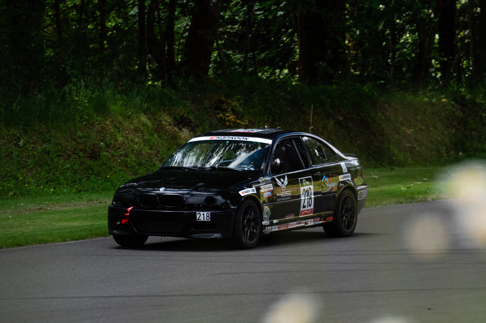

# Broken MotorWerks Telemetry

## Introduction

This project encompasses a real-time telemetry system for Broken MotorWerk's [LDRL](https://www.racelucky.com/) race car. The project consists of a rust application running on an ESP-32 that reads CAN data from the vehicle, and broadcasts the data over an XBEE RF link.



This project is a playground for a Rust based telemetry system.

## Project Goals

- [ ] Custom PCB utilizing esp-32-c3
- [ ] Telemetry application
- [ ] Client application for real-time monitoring
  - [ ] GUI or dashboard based application
  - [ ] Alarms and position monitoring
- [ ] Cloud integration

## Components

### PCB

- ESP32-­C3-­MINI-­1
- [Digi XBee-PRO 900HP RF Module](https://www.digi.com/products/embedded-systems/digi-xbee/rf-modules/sub-1-ghz-rf-modules/xbee-pro-900hp)
- [SN65HVD230](https://www.ti.com/product/SN65HVD230) CAN transceiver

## Developing

Project is based on the [esp-rust-board](https://github.com/esp-rs/esp-rust-board/tree/v1.2).

```shell
cargo espflash --monitor --speed 921600 /dev/ttyACM0
```
